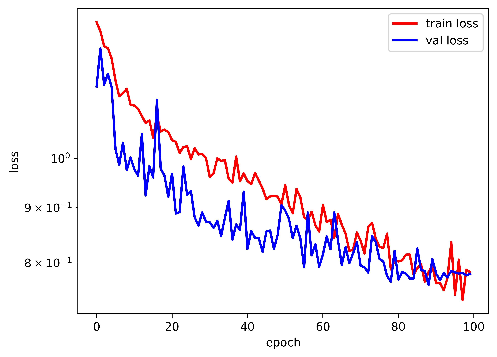
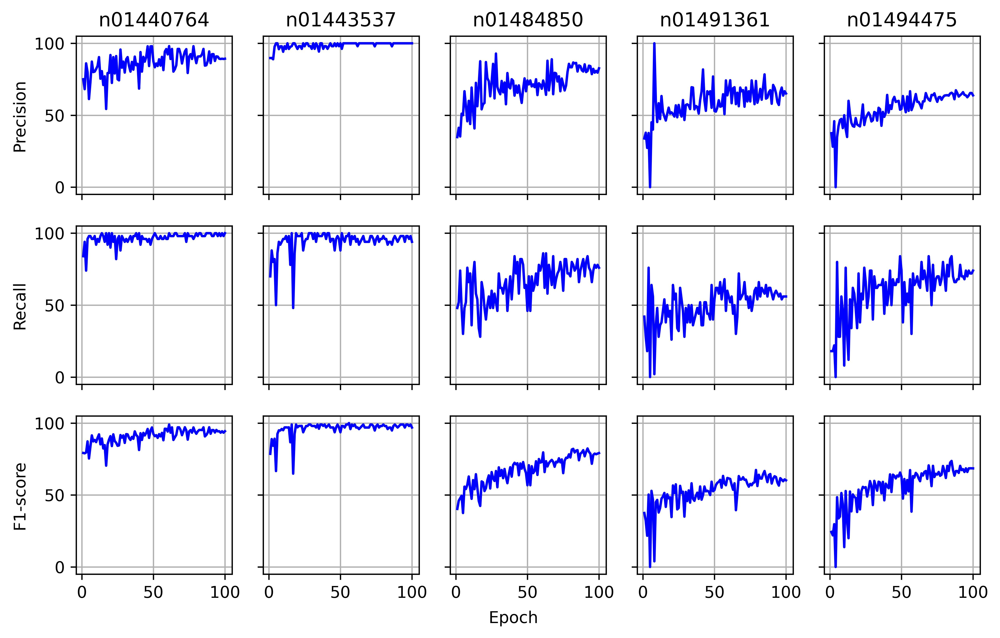
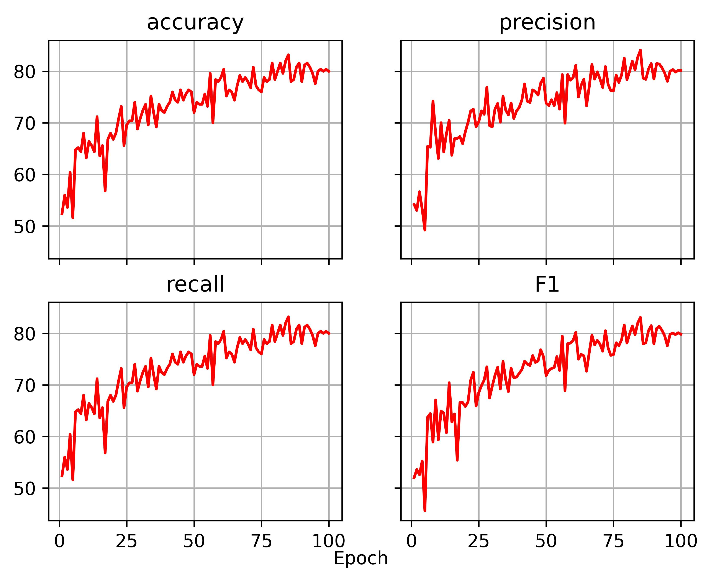
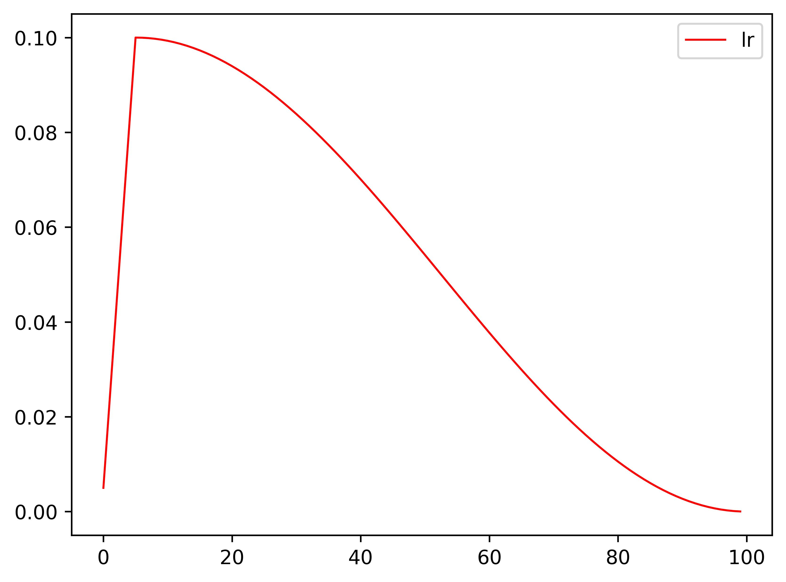
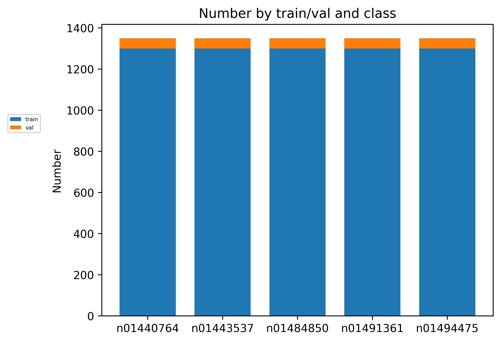
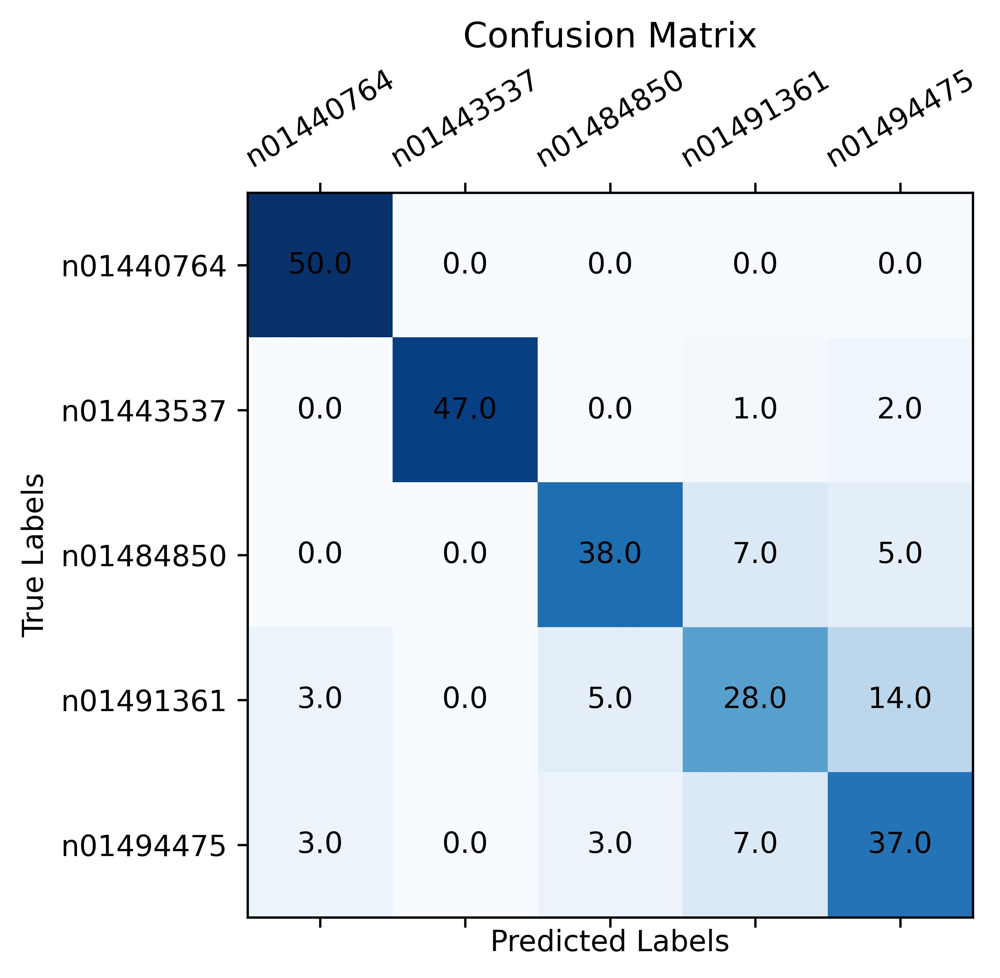

# 深度学习在图像分类中的应用

## 前言

起因：因为我看github上面很多其他计算机视觉任务的集成，都写得很好了，但是分类这块，一直没找到我想要的那种，索性自己整理了一个符合自己需求的。以后也会陆续添加模型。

* 本仓库是对本人本科生期间的研究内容进行整理总结，总结的同时也希望能够帮助更多的小伙伴。
* 本仓库使用Pytorch进行网络的搭建与训练。
* 本仓库参考的链接附在最后。感谢大家的支持。

## 目前

#### 2022.03.04

* 增加了一机多卡的分布式训练
* 增加了resume功能
* 增加了关于数据增强、优化器可调节、只测试不训练的参数
* 增加了AdderNet
* 修复了若使用Mixup或Cutmix，则在Windows上必须设置num_worker=0的BUG
* 优化了train_config.py
* 优化了关于dataloader的参数，默认情况下比之前加载数据更快

#### 2022.02.05

* 增加了exponential_lr的训练策略
* 增加了constant的warmup策略
* 修复了路径在Ubuntu下不适用的BUG
* 修复了无warmup时画学习率报错的BUG

#### 2022.02.04

* 优化了优化器和训练策略的代码
* 优化了数据增强的代码
* 优化了train_config.py
* 删除了Flocal Loss，分类当中用Label Smooth足够了

#### 2022.02.03

* 纠正了环境配置
* 增加了['simple', 'ra', 'tawide', 'imagenet', 'cifar10', 'svhn']的数据增强
* 增加了cutmix、mixup、ema、clip_grad
* 优化了外部apex为torch.cuda.apex
* 优化了断点续训的功能
* 优化了Label Smooth

#### 2022.02.02

* 纠正了环境配置
* 增加了cosine训练策略的学习率最小值的限制
* 增加了ConvNeXt、SwinTransformer
* 增加了混淆矩阵的可视化
* 增加了断点续训的功能
* 增加了一键读取config训练的功能
* 优化了混淆矩阵的生成
* 优化了train_config和predict_config
* 修复了plot_lr与scheduler首个学习率冲突的BUG

#### 2021.08.05

* 纠正了环境配置
* 增加了Focal Loss
* 增加了tools中可视化的工具
* 优化了记录每次exp的result及plot
* 修复了predict.py读取class_indices.json的BUG
* 修复了adamw优化器和plot_lr冲突的BUG

#### 2021.07.29

* 纠正了环境配置
* 增加了tools中创建数据的工具

#### 2021.07.28

* 增加了ResMlp-Mixer VoVNet se-resnet SqueezeNet MnasNet模型
* 增加了tools中转换权重、计算模型参数、模型FPS、模型吞吐量的工具
* 更新了权重加载方式和权重链接
* 优化了logs文件夹，记录每次exp的config，添加requirements.txt并纠正环境配置
* 修复了warmup_epoch=0的BUG

#### 2021.07.25

* first commit

# 支持模型

```
#  --------------------------------------------------------------------------------------
# |model_prefix    |model_suffix                                                         |
# |--------------------------------------------------------------------------------------|
# |vgg             |11 13 16 19 bn11 bn13 bn16 bn19                                      |
# |--------------------------------------------------------------------------------------|
# |resnet          |18 34 50 101 152                                                     |
# |--------------------------------------------------------------------------------------|
# |resnext         |50-32x4d 101-32x8d                                                   |
# |--------------------------------------------------------------------------------------|
# |regnetx         |200mf 400mf 600mf 800mf 1.6gf 3.2gf 4.0gf 6.4gf 8.0gf 12gf 16gf 32gf |
# |--------------------------------------------------------------------------------------|
# |regnety         |200mf 400mf 600mf 800mf 1.6gf 3.2gf 4.0gf 6.4gf 8.0gf 12gf 16gf 32gf |
# |--------------------------------------------------------------------------------------|
# |mobilenetv2     |0.25, 0.5, 0.75, 1.0, 1.25, 1.5                                      |
# |--------------------------------------------------------------------------------------|
# |mobilenetv3     |small large                                                          |
# |--------------------------------------------------------------------------------------|
# |ghostnet        |0.5 1.0 1.3                                                          |
# |--------------------------------------------------------------------------------------|
# |efficientnetv1  |b0 b1 b2 b3 b4 b5 b6 b7                                              |
# |--------------------------------------------------------------------------------------|
# |efficientnetv2  |small medium large                                                   |
# |--------------------------------------------------------------------------------------|
# |shufflenetv2    |0.5 1.0 1.5 2.0                                                      |
# |--------------------------------------------------------------------------------------|
# |densenet        |121 161 169 201                                                      |
# |--------------------------------------------------------------------------------------|
# |xception        |299                                                                  |
# |--------------------------------------------------------------------------------------|
# |vit             |base-patch16 base-patch32 large-patch16 large-patch32 huge-patch14   |
#  --------------------------------------------------------------------------------------
# |resmlp-mixer    |12 24 36 B24                                                         |
#  --------------------------------------------------------------------------------------
# |vovnet          |27slim 39 57                                                         |
#  --------------------------------------------------------------------------------------
# |se-resnet       |18 34 50 101 152                                                     |
#  --------------------------------------------------------------------------------------
# |squeezenet      |1.0 1.1                                                              |
#  --------------------------------------------------------------------------------------
# |mnasnet         |0.5 0.75 1.0 1.3                                                     |
#  --------------------------------------------------------------------------------------
# |swint           |base-224 base-384 small-224 tiny-224 large-224 large-384             |
#  --------------------------------------------------------------------------------------
# |convnext        |tiny small base large xlarge                                         |
#  --------------------------------------------------------------------------------------
# |addernet        |50                                                                   |
#  --------------------------------------------------------------------------------------
```

# 训练准备

## 数据格式

```
# -data
#   -train
#     -class_0
#       -1.jpg
#     -class_1
#     -...
#   -val
#     -class_0
#     -class_1
#     -...
```

## 环境配置

* Anaconda3
* python 3.8
* pycharm(IDE， 建议使用)
* pytorch 1.10(若不需要SwinT，降级到1.8是没问题的)
* torchvision 0.11.1
* Cuda10.2

### 安装Pytorch

```
# Windows & Linux
conda create -n torch110 python=3.8
conda activate torch110
pip3 install torch==1.10.0+cu102 torchvision==0.11.1+cu102 -f https://download.pytorch.org/whl/cu102/torch_stable.html
```

# 训练

在train_config.py中修改你想要的模型配置，注意，我的代码中，**每个模型有2部分组成**，分别是model_prefix和model_suffix。

例如**搭建shufflenetv2_0.5**：

```
model_prefix='shufflenetv2'
model_suffix='0.5'
```

我写了关于参数用途的注释在train_config.py中。
如果你是单卡，在train_config.py配置好之后运行train.py或predict.py。

如果要使用多卡，使用以下指令启动，注意直接运行是不可以的，需要在终端输入。

```python -m torch.distributed.launch --nproc_per_node=2 --use_env train_multi_gpu.py```

其中```nproc_per_node```为GPU的数量，更详细的请在train_config.py下方查看。


# 可视化相关指标

训练完成之后在你的log_dir中查看训练过程。

<center>
<figure>






</figure>
</center>

# 预测

* 我只写了单张图片的预测，但是你可以在我的基础上很灵活的更改成适合你项目需求的预测代码。

* 同样的，在predict_config.py中修改load_from，predict_img_path。

# 模型权重

* 我对torch的官方权重或者是原论文作者放出的权重进行了收集，所以应该不存在模型出错的问题，如果有，请及时通知我。并且在每一个model.py中注明了权重链接。但注意，因为本人能力有限，仍有部分模型的权重搜集不到，如果你有相关的权重链接，请通知我！

* 在utils/general.py中有加载权重的方式：取模型和权重的公共的相同维度的键值对进行加载。因为这样可以基于你魔改之后的网络的部分权重加载。

  * densenet 链接：https://pan.baidu.com/s/1Lo-xSbR_9VpvfDJrXO31Fg?pwd=BDAS   提取码：BDAS 
  * efficientnetv1 链接：https://pan.baidu.com/s/1KDWtBzVn78C6xZrOBC9lkg?pwd=BDAS   提取码：BDAS 
  * efficientnetv2 链接：https://pan.baidu.com/s/1sLYyrRAeHd7XNo7l9pHQhg?pwd=BDAS   提取码：BDAS 
  * mobilenetv2 链接：https://pan.baidu.com/s/1YA5qgVN-PICEZXwhlwzOig?pwd=BDAS   提取码：BDAS 
  * mobilenetv3 链接：https://pan.baidu.com/s/1fijzykqVz5cvv8w_OZgR4w?pwd=BDAS   提取码：BDAS 
  * regnet 链接：https://pan.baidu.com/s/1WDfgFcmudzMOOceViRY1BQ?pwd=BDAS   提取码：BDAS 
  * ghostnet 链接：https://pan.baidu.com/s/1QByMVopEXgMsnNEIln9q5g?pwd=BDAS   提取码：BDAS 
  * resne(x)t 链接：https://pan.baidu.com/s/14rd042Ra6DhscNHqtEk38A?pwd=BDAS   提取码：BDAS 
  * shufflenetv2 链接：https://pan.baidu.com/s/1hMxjwOE02aDXL7nM6smFRw?pwd=BDAS   提取码：BDAS 
  * vgg 链接：https://pan.baidu.com/s/1HkY--EQJauwp-Cq1bKyd9w?pwd=BDAS   提取码：BDAS 
  * xception 链接：https://pan.baidu.com/s/19uo_dLENcuL1oFznLvl24A?pwd=BDAS   提取码：BDAS 
  * vit 链接：https://pan.baidu.com/s/15OTxNPDWkgdiuqZWSQ7sUw?pwd=BDAS   提取码：BDAS 
  * resmlp-mixer 链接：https://pan.baidu.com/s/1_qHcRdy65JatyHrHx5fReQ?pwd=BDAS   提取码：BDAS 
  * vovnet 链接：https://pan.baidu.com/s/1vaY-WOJdLwONiB_HYcpvpA?pwd=BDAS   提取码：BDAS 
  * se-resnet 链接：https://pan.baidu.com/s/1Zs4gs7MR3pm25Vilqo3yyA?pwd=BDAS   提取码：BDAS 
  * squeezenet 链接：https://pan.baidu.com/s/10NDqSJH4sgDZroGriTU3uQ?pwd=BDAS   提取码：BDAS 
  * mnasnet 链接：https://pan.baidu.com/s/1Vs3c-qU0IyQCs7BUpQ5HaA?pwd=BDAS   提取码：BDAS 
  * swint 链接：https://pan.baidu.com/s/1H4bdl4n6mOIRnzvvawFz8w?pwd=BDAS  提取码：BDAS 
  * convnext 链接：https://pan.baidu.com/s/1mDbieiXhWVFfrfS0_jGRpQ?pwd=BDAS  提取码：BDAS 
  * addernet 链接：https://pan.baidu.com/s/1wqNOtOVkpAtErkqeTfI26Q?pwd=BDAS  提取码：BDAS
  
# 参考

1. https://github.com/pytorch/vision/tree/master/torchvision/models

2. https://github.com/WZMIAOMIAO/deep-learning-for-image-processing/tree/master/pytorch_classification

3. https://github.com/rwightman/pytorch-image-models/tree/master/timm/models

4. https://github.com/yizt/Grad-CAM.pytorch

# 联系方式

bilibili：https://space.bilibili.com/315678922

E-mail：201902098@stu.sicau.edu.cn
